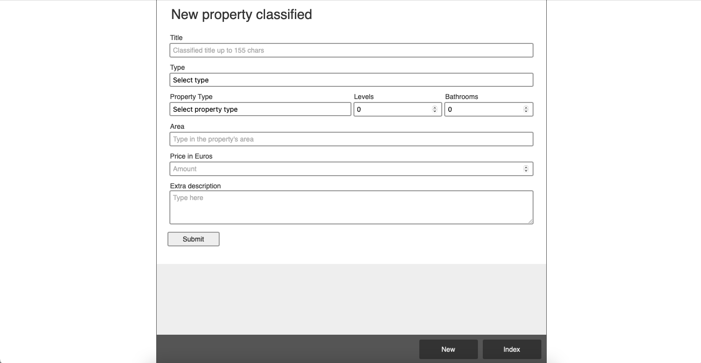

# XE-Challenge

### This project was built as a challenge by the need to show a representative product of my skills and use it as an artifact to base further discussions during my hiring process by the Ads News Paper titled *Chrisi Efkeria* (Χρυσή Ευκαιρία)
<hr/>
<br/><br/>

<!--
*** Thanks for checking out this README Template. If you have a suggestion that would
*** make this better, please fork the repo and create a pull request or simply open
*** an issue with the tag "enhancement".
*** Thanks again! Now go create something AMAZING! :D
-->

<!-- PROJECT SHIELDS -->
<!--
*** I'm using markdown "reference style" links for readability.
*** Reference links are enclosed in brackets [ ] instead of parentheses ( ).
*** See the bottom of this document for the declaration of the reference variables
*** for contributors-url, forks-url, etc. This is an optional, concise syntax you may use.
*** https://www.markdownguide.org/basic-syntax/#reference-style-links
-->

[![Contributors][contributors-shield]][contributors-url]
[![Forks][forks-shield]][forks-url]
[![Stargazers][stars-shield]][stars-url]
[![Issues][issues-shield]][issues-url]

<br/><br/>


<!-- PROJECT LOGO -->
<br />
<p align="center">
  <a href="https://github.com/ioanniskousis/xe-challenge" style="display: block; width:160px; height:160px; border-radius: 50%; overflow: hidden;">
    
  </a>
  
  <h3 align="center">xe-challenge Application</h3>
  
  <p align="center">
    <a href="https://github.com/ioanniskousis/xe-challenge"><strong>Explore the docs</strong></a>
    <br />
    <br />
    <h1 style="text-align: center"><a href="https://serene-garden-89371.herokuapp.com">Working Demo</a></h1>
    <a href="https://github.com/ioanniskousis/xe-challenge/issues">Report Bug</a>
    <a href="https://github.com/ioanniskousis/xe-challenge/issues">Request Feature</a>
  </p>
</p>

<br/>
<hr/>

<!-- TABLE OF CONTENTS -->

## Contents

- [About the Application](#about-the-application)
- [Development](#development)
- [Screen Shots](#application-screen-shots)
- [Testing](#testing)
- [Live Version](#live-version)
- [Built With](#built-with)
- [Contributors](#contributors)
  
<hr/>

<br/><br/>

<!-- ABOUT THE APPLICATION -->

## About the application

The application handles a database of real estate advertisements. For the purposes of the challenge it is limited to the data entry form and the index view which implements the root of the user's interface.  

Using the entry form the user can insert a title, the type of the ad selected from the list [Rent, Buy, Exchange, Donate], the property type selected from the list [Residential, Commercial, Industrial, Agricultural, Special purpose], the number of levels, the number of bathrooms, the Area, the Price, and the Description of the property.  

The field of the area must be selected from a list which is populated by an API connection returning a collection of areas matching the user's input text. By selecting an option of the returned collection, a hidden field is assigned the *placeId* referencing to the selected area. This hidden field is stored with the rest of the record's data into the database.

All fields except the Description, Price, and Property Type are required and the number of Levels and the number of Bathrooms must be at least 0.

The *Properties index* view presents a table of all the ads held in the database in a concise form. By clicking an entry, the user can edit each record using a form similar to the data entry form.  

<hr/>

<!-- APPLICTION SCREENSHOTS -->

## Development

The project is built using Ruby v3.0.1 and Rails v6.1.3.1.  
The initialisation command is 
```
rails new xe-challenge -d=postgresql -T
```
The database facility is configured to use sqlite3 for development and test environments, and pg (postgres) for production environment.  
 
In order to make code more consistent and avoid bugs there were installed the following linters:
- For Javascript installed the *ESLint* tool.
- For Ruby installed *rubocop*
- For Stylesheets installed *stylelint*

Unit Tests are implemented by installing RSpec.

The project has only one entity to hold real-estate records. One scaffold was generated for this with the command as follows:
```
rails generate scaffold realestate title:string adType:integer propertyType:integer levels:integer bathrooms:integer area:string placeId:string price:float description:text user_id:integer
```

<hr/>

<!-- APPLICTION SCREENSHOTS -->

## Application Screen Shots
<hr/>

#### Entry Form


<hr />

#### Properties Index


<hr />

<!-- TEST -->

## Testing
RSpec has been used for testing the application.  
Find test units in app/spec/realestates_model_spec.rb file where the Realestate model is tested.

To run testing suite using RSpec in terminal window enter 

```
  rspec . --format documentation
```

<hr/>


<!-- LIVE VERSION -->

## Live version

### You can see it working on heroku [](https://serene-garden-89371.herokuapp.com)


<hr/>

<!-- BUILT WITH -->

## Built With

This project was built using these technologies.

- Ruby version 3.0.1
- Ruby On Rails version 6.1.3.1
- Javascript (ES6)
- HTML5
- CSS3
- webpack
- rspec
- ESLint
- rubocop
- stylelint
- Heroku

<hr/>

<!-- CONTACT -->

## Contributors

:bust_in_silhouette: **Author**

## Ioannis Kousis

- Github: [@ioanniskousis](https://github.com/ioanniskousis)
- Twitter: [@ioanniskousis](https://twitter.com/ioanniskousis)
- Linkedin: [Ioannis Kousis](https://www.linkedin.com/in/jgkousis)
- E-mail: jgkousis@gmail.com


<hr/>

<!-- MARKDOWN LINKS & IMAGES -->
<!-- https://www.markdownguide.org/basic-syntax/#reference-style-links -->

[contributors-shield]: https://img.shields.io/github/contributors/ioanniskousis/xe-challenge.svg?style=flat-square
[contributors-url]: https://github.com/ioanniskousis/xe-challenge/graphs/contributors
[forks-shield]: https://img.shields.io/github/forks/ioanniskousis/xe-challenge.svg?style=flat-square
[forks-url]: https://github.com/ioanniskousis/xe-challenge/network/members
[stars-shield]: https://img.shields.io/github/stars/ioanniskousis/xe-challenge.svg?style=flat-square
[stars-url]: https://github.com/ioanniskousis/xe-challenge/stargazers
[issues-shield]: https://img.shields.io/github/issues/ioanniskousis/xe-challenge.svg?style=flat-square
[issues-url]: https://github.com/ioanniskousis/xe-challenge/issues
